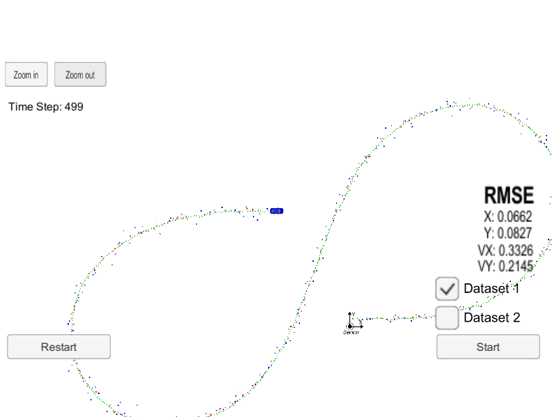
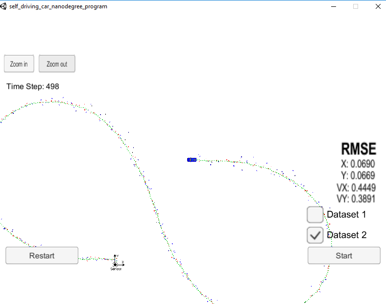

Unscented Kalman Filter Project Starter Code

Self-Driving Car Engineer Nanodegree Program

In this project utilize an Unscented Kalman Filter to estimate the state of a moving object of interest with noisy lidar and radar measurements. Passing the project requires obtaining RMSE values that are lower that the tolerance outlined in the project reburic.

Skip to content This repository Search Pull requests Issues Marketplace Explore @ssvat Sign out Watch 0 Star 0 Fork 0 ssvat/sdc-ukf Code Issues 0 Pull requests 0 Projects 0 Wiki Insights Settings Branch: master Find file Copy pathsdc-ukf/readme.txt f8fe42a 9 minutes ago @ssvat ssvat Update readme.txt 1 contributor RawBlameHistory
38 lines (24 sloc) 2.07 KB PROJECT DESCRIPTION The project "unscented Kalman filter" is based on the same structure as the extended Kalman filter. It uses a main file that calls a function called ProcessMeasurement. Anything important happens in this function. The function is part of the class ukf.

Build instructions

a. Clone this repo. b. Make a build directory: mkdir build && cd build c. Compile: cmake .. && make d. ./UnscentedKF

Introduction

Tuning In the ukf.cpp file, the paramters that can be tuned includes std_a, std_yawd, and the initialization of x_ and P_ for Radar and Lidar, respectively.
I tested the process noise standard deviation longitudinal acceleration, std_a_, from 0.2 up to 1.2. Finally the value of 1.2 is set. This means the acceleration is not relatively high. The process noise standard deviation yaw acceleration, std_yawd_, was tested from 0 to 0.5 and finally set as 0.5. The state covariance, P_, was set as an identical matrix for initialization for both sensors. The results have been experimented with different initialization for radar as the RMSEs were higher than those of Lidar. The explanation is show below: x_ for Radar: This was based off the first radar measurement. The middle value, v, has been tuned to a value of 4 m/s, equal to an average bike speed of 15.5 km/h. x_ for Lidar: The first two values are filled by the 'px' and 'py' lidar measurements. Others are set to zero and the results are pretty good.

Comparisons Here I present my results (mostly are close or lower than the criteria [.09, .10, .40, .30], along with results of my previous Extended Kalman Filter. As expected, the Unscented Kalman Filter that deals with nonlinear problems is more accurate than the Extended Kalman Filter.

Parameter	UKF-Data1	UKF-Data2	EKF-Data1	UKF-Data2 px 0.0973	0.0726	0.0662	0.0690 py	0.0855	0.0967	0.0827	0.0669 vx 0.4513	0.4579	0.3326	0.4449 vy	0.4399	0.4966	0.2145	0.3891

| Parameter| RMSE-EKF-Data1| RMSE-EKF-Data2| RMSE-UKF-Data1| RMSE-UKF-Data2| 
|:--------:|:-------------:|:-------------:|:-------------:|:-------------:| 
| px       |     0.0973    |     0.0726    |     0.0662    |     0.0690    |
| py       |     0.0855    |     0.0967    |     0.0827    |     0.0699    |
| vx       |     0.4513    |     0.4579    |     0.3326    |     0.4449    |
| vy       |     0.4399    |     0.4966    |     0.2145    |     0.3891    |
px and py represent position in x and y direction, respectively while vx and vy represent velocities in x and y direction. RMSE is the root mean squared error.

